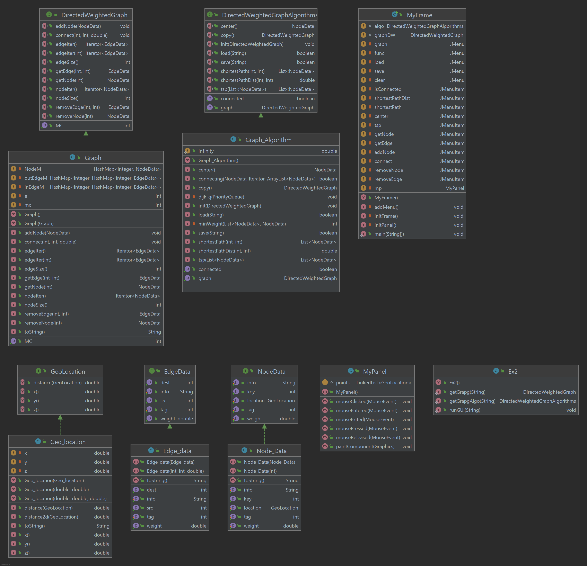

# OOP - Task 2
## Authors:  
Noam David-319073235  
Gaya Ossi- 208575480
## Explanation
In this project we created a weighted graph- By a different departments.
The departments we have implemented and used are:
- NodeData : In this class we implemented operations on a node (vertex) in a weighted-directional graph. (the key vertex, Location, weight of each node).
- EdgeData :In this class we implemented operations on a edge in a weighted-directional graph. 
- The edge is build from src (source node) and from dest (destination node), and the weight is the distance between those nodes. 
- Geo_location : This interface represents a geo location <x,y,z>.
- Directed weighted graph: In this class we created a directional weighted graph using type data structures of hashmaps.
We created hashmap for the graph nodes and two hashmaps for the edges of the graph.(one represents the in edges and the second represents the out edges).
Using this hashmaps we implemented operations on the graph, like adding nodes/edges or removing them.
- DirectedWeightedGraph_Algorithm: In this class we implemented a number of algorithms for several methods: we copied the graph, we checked if the graph is connected strong,we found the short path between tow nodes, 
we found the center of the graph and the short route that goes over all the node and we loaded and saved a json files.
## Algorithms used in this project
- Dijkstra's algorithm (https://en.wikipedia.org/wiki/Dijkstra%27s_algorithm) to find the shortest path and to find the center of the graph we used the 'shortestPathDist' function.
- we built a help function called 'minWeight' to find the shortet route that goes over all the nodes- this function checked the short weight between the nodes and create a path that we need.
## UML:

